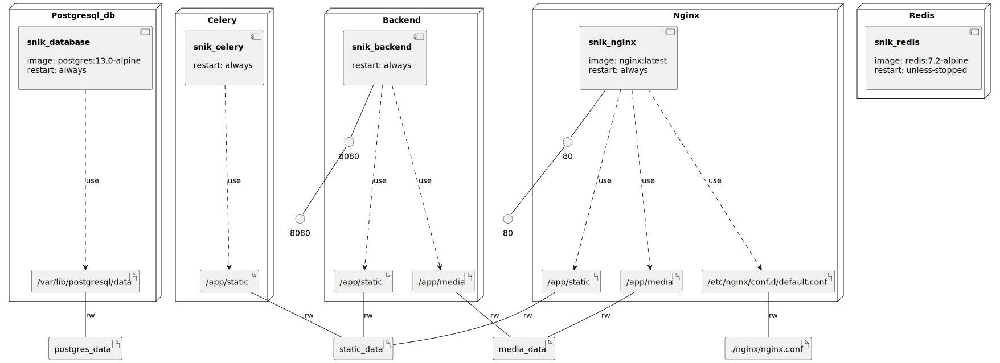

# Django E-Commerce Project

An e-commerce website built using the Django framework.

## How to run?
1. Clone the repo from GitHub: `https://github.com/ddosmukhambetov/snik_store.git`
2. Set the values in the .env file
3. Build the project: `docker compose build`
4. Run the project: `docker compose up`

In a new terminal, you can create a superuser using the command: `docker exec -it snik_backend python manage.py createsuperuser`
You can also generate fake products using the command: `docker exec -it snik_backend python manage.py fake_products`, but before that, create several categories in the admin panel.

## Technologies

Celery, DRF, Swagger & Redoc docs, Stripe and more!

### Infrastructure model

- [snik_backend component model](.infragenie/snik_backend_component_model.svg)

---
